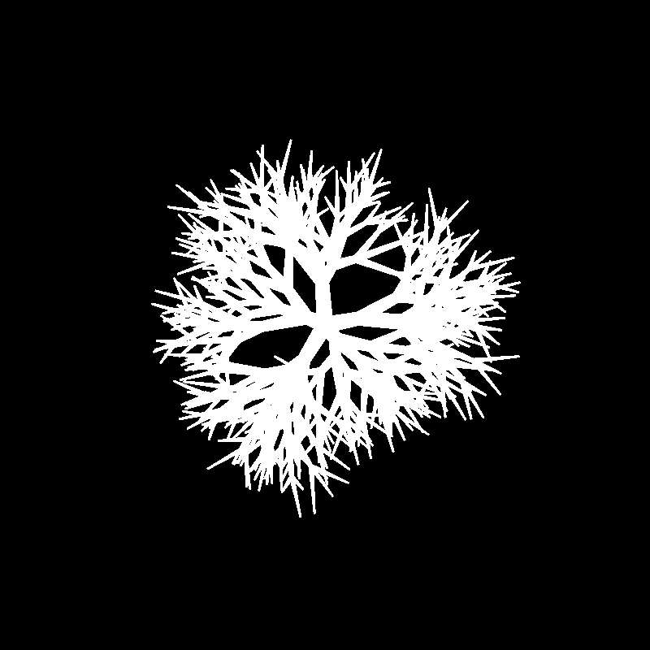

# Python tree silhouette generator 
A python library to generate parametric silhouettes of trees.
It widely uses [Numpy][1] library.

**Animation of the working algorithm:**  
  
**Final result**  
  

## Structure
The modules are:
- *branches.py*: The one that actually generates the trees
- *examples.py*: Contains three examples of the script usage
- *renderer.py*: Implements a REALLY slow renderer that outputs a pgm file.
- *test.py*: Uses [pygame][2] with [PyOpenGL][3] to display quickly 
the generated trees
- *utilities.py*: Contains some mathematical utilities

## How does this works
The main function is *branches.branch()*. It is a second order function that 
needs a lot of parameters to work but the most important one is surely 
**angle_fn**. It must be a function that returns a tuple of
angles expressed in radians. For every angle returned at each recursive step
by this function a new branch will generate starting from the current cartesian 
references expressed in **start_matrix**.

[1]: http://www.numpy.org/
[2]: http://www.pygame.org/
[3]: http://pyopengl.sourceforge.net/
